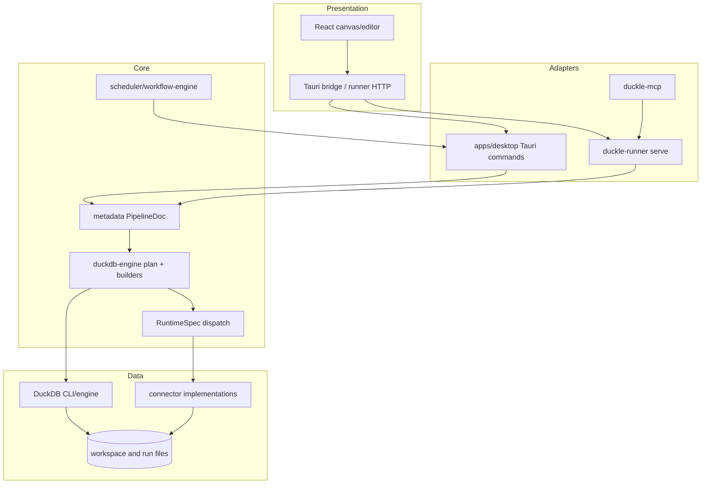
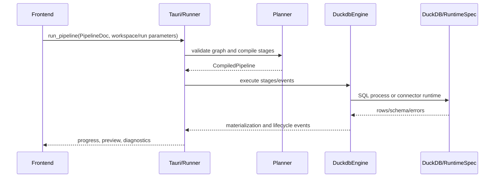
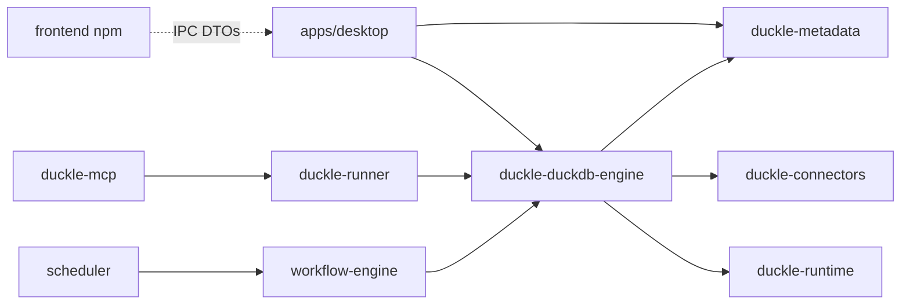

# Duckle — Architecture Documentation

**Evidence basis**: repository files, Cargo manifests, frontend package/configuration, Tauri configuration, CI definitions and source code inspected on 2026-07-15. Runtime behavior and transitive vulnerability status are not inferred when not represented in the repository.

## 1. Project Structure

### Directory layout

```text
apps/desktop/                 Tauri application and desktop commands
crates/metadata/              Serializable pipeline metadata
crates/duckdb-engine/         Planner, SQL builders, executor, connectors
crates/connectors/            Connector implementations/contracts
crates/runtime/               Runtime abstractions
crates/execution-core/        Shared execution primitives
crates/workflow-engine/       Workflow/control-flow execution
crates/transform-engine/      Transform implementations
crates/stream-engine/         Streaming execution
crates/scheduler/             Scheduling and triggers
crates/duckle-runner/         Web/CLI runner and HTTP bridge
crates/duckle-mcp/            MCP server integration
crates/plugin-sdk/            Extension SDK
crates/slothdb-engine/        Alternate engine
crates/duckle-lance/          Lance-specific engine/storage
frontend/                     React/Vite editor and workspace UI
docs/architecture/            Human-maintained architecture references
.github/workflows/            GitHub CI/release
```

### Module organization and build

`Cargo.toml` is a resolver-2 workspace with Rust 2021, minimum Rust 1.80, and shared dependencies. `frontend/package.json` defines Vite development/build and TypeScript lint (`tsc --noEmit`). `apps/desktop/tauri.conf.json` and the Tauri crate package the frontend into a desktop binary. No Java/Spring, Python or .NET modules were detected.

## 2. Core Components

### Application entry points

- `apps/desktop/src/main.rs` starts the Tauri application; `apps/desktop/src/lib.rs` registers plugins, state and the `tauri::generate_handler!` command list.
- `crates/duckle-runner/src/main.rs` is the standalone runner entry point.
- `frontend/src/main.tsx` is the React entry point (Vite configuration in `frontend/vite.config.ts`).

### Handlers and communication

Desktop handlers are Rust functions annotated `#[tauri::command]` in `apps/desktop/src/lib.rs`, `app_settings.rs` and `secrets.rs`. The invoke handler is assembled in `lib.rs`; frontend calls are wrapped by `frontend/src/tauri-bridge.ts`. The runner exposes HTTP/web streaming paths in `crates/duckle-runner/src/serve.rs`. Events are emitted through Tauri and mirrored by runner/web stream DTOs.

### Planner and executor

`crates/duckdb-engine/src/plan/` converts metadata and component properties into a compiled graph of `Stage` values. SQL-capable stages use DuckDB builders; connector- or control-flow-specific stages carry `RuntimeSpec` variants. `crates/duckdb-engine/src/lib.rs` chooses a batched SQL path when the whole run is eligible, otherwise spawns/coordinates per-stage execution and materializes intermediate relations.

### Data and persistence

The frontend owns workspace persistence (`frontend/src/workspace.ts`) using JSON repository metadata and per-item directories for pipelines, connections, contexts, routines and documents. Connection secrets are encrypted through `apps/desktop/src/secrets.rs`. Run-scoped DuckDB, Parquet and marker files are owned by the engine and cleaned after execution.

### Models and errors

Pipeline/node/edge types are primarily serializable TypeScript and Rust metadata. Runtime errors are represented through `Result`/`thiserror`/`anyhow` at Rust boundaries and converted to string/DTO diagnostics for IPC. There is no single global `Component`, `StageResult` or domain-error registry; contracts are distributed across metadata, planner and bridge modules.

## 3. Architecture Overview

### Architectural style

The codebase is a local-first modular monolith with layered boundaries: presentation (React), desktop/HTTP adapters (Tauri and runner), graph metadata/planning, execution engines, and connector integrations. It is not a microservice deployment. The planner/executor boundary resembles a compiler pipeline: declarative graph → validated stages → SQL or runtime dispatch → materialized run outputs.

### Component diagram



### Execution sequence



### Design patterns observed

- **Builder/strategy**: planner builders select connector-specific SQL or `RuntimeSpec` strategies.
- **Materialization boundary**: VIEW/TABLE/Parquet/DuckDB outputs decouple stages that cannot share a process.
- **Capability/manifest catalog**: frontend manifests and generated catalog drive palette/editor availability.
- **Process isolation**: DuckDB and selected connector/AI subprocesses are spawned with cancellation/cleanup handling.
- **DAG compilation**: graph edges are topologically ordered; partial runs compile a selected upstream subgraph.

## 4. Detailed Component Analysis

### Frontend

- **Purpose**: visual pipeline authoring, workspace/repository UI, preview and run controls.
- **Key files**: `frontend/src/App.tsx`, `ProjectTree.tsx`, `pipeline-types.ts`, `workspace.ts`, `tauri-bridge.ts`, component manifests.
- **Dependencies**: React 19, React Flow, i18next, Prism, Vega, Tauri JS API, Vite.
- **Coupling**: serialized node properties and bridge command/event names must match Rust metadata and Tauri handlers.

### Desktop adapter

- **Purpose**: native window, filesystem/settings/secrets, command registration and embedded runner integration.
- **Key files**: `apps/desktop/src/lib.rs`, `secrets.rs`, `app_settings.rs`, `engine_manager.rs`, `tauri.conf.json`.
- **Coupling**: capability configuration, frontend invoke names, engine binary paths and encrypted workspace key format.

### DuckDB engine

- **Purpose**: compile graph nodes, generate SQL, execute DuckDB and connector RuntimeSpecs, emit run results.
- **Key files**: `src/plan/mod.rs`, `src/plan/builders.rs`, `src/plan/specs.rs`, `src/lib.rs`, `src/connectors.rs`.
- **Execution modes**: full-pipeline batch (`execute_batched`) versus per-stage process execution; attach-backed sources have special materialization/alias rules.
- **Coupling**: planner output shape, temporary database paths, DuckDB binary/extension availability and downstream relation names.

### Runner and MCP

- **Purpose**: run the product without the desktop shell and expose HTTP/MCP integration.
- **Key files**: `crates/duckle-runner/src/main.rs`, `serve.rs`, `crates/duckle-mcp`.
- **Coupling**: must preserve command/event DTO parity and secret masking while lacking the desktop’s native secret UI boundary.

### Scheduling and workflows

`crates/scheduler` and `crates/workflow-engine` provide trigger/control-flow concerns above engine execution. The engine also dispatches RuntimeSpec control-flow variants such as iterate, foreach, parallelize, wait and die; therefore scheduling semantics are distributed rather than owned by one scheduler abstraction.

## 5. Dependency Analysis

### Direct dependency categories

| Category | Declared examples | Owner |
|---|---|---|
| UI/build | React, Vite, TypeScript, `@xyflow/react` | frontend |
| Desktop | Tauri 2, Tauri plugins | apps/desktop |
| Serialization/errors | serde, serde_json, anyhow, thiserror | workspace |
| Async/concurrency | tokio, futures, async-trait | workspace/crates |
| Columnar/database | DuckDB, rusqlite, Arrow 53, Parquet 53 | engine/connectors |
| Scheduling | cron | scheduler |
| Logging | tracing, tracing-subscriber | workspace |
| Connector/network | connector-specific Rust crates | connectors/engine |

### Dependency graph



Versions are pinned in the workspace manifest/lockfile; security advisories are not evaluated by this static index. Cargo and npm dependencies can introduce transitive versions not visible in the short manifest table, so `Cargo.lock` and `frontend/package-lock.json` are the authoritative resolved sets when present.

## 6. Performance Considerations

### Database and I/O patterns

DuckDB provides vectorized SQL execution. Sources and transforms frequently materialize to temporary DuckDB tables, views, Parquet or files. Attach-backed and remote sources may load extensions and use `ATTACH`; connector RuntimeSpecs can perform network I/O and stream data through Rust. Large transfers are intentionally materialized at boundaries to preserve cross-process compatibility.

### Async and concurrency

Tokio is used at Tauri/runner boundaries, while the engine also uses OS threads for subprocess stdout/stderr and connector work. Parallel branches and RuntimeSpec `Parallelize` can create multiple worker threads. The current process-per-stage model limits shared-session reuse but reduces cross-stage state leakage.

### Caching and pooling

No general-purpose application cache or connection-pool abstraction was found in the inspected modules. DuckDB temporary files and materialized relations are run-scoped rather than cross-run caches. External connector pooling behavior is connector-specific.

### Resource management risks

- DuckDB CLI and connector subprocesses require coordinated stdout/stderr draining and cancellation.
- Extension installation and remote connector calls can make run duration/environment dependent.
- Temporary database, WAL, Parquet and secret files must be cleaned on success, failure and cancellation.
- Parallel branches can increase memory and file contention; no global resource budget abstraction is evident.

### Scalability analysis

The architecture scales vertically on one machine and can fan out independent branches. It is intentionally not a distributed executor: workspace, scheduler state and temporary databases are local. The runner can expose web execution, but no evidence of a horizontally coordinated worker cluster or shared durable queue was found.

### Performance recommendations (static observations)

1. Keep materialization decisions explicit for high-cardinality branches and avoid unnecessary cross-process copies.
2. Instrument attach/extension startup, subprocess lifetime, row counts and temporary-file sizes in run diagnostics.
3. Bound concurrency and memory for parallel branches and connector streaming.
4. Treat any future shared DuckDB session/worker as a separate resource with framing, cancellation and cleanup contracts.

## 7. Technical Debt and Risks

### Identified issues

- Serialized contracts are distributed across TypeScript, Rust metadata, component manifests and IPC; changes require multi-surface coordination.
- There is no central registry for component capabilities or a single typed error/result model.
- Desktop secret decryption is native-command scoped; runner/web secret handoff has a different boundary.
- Existing executor behavior is optimized for per-stage process isolation/batch eligibility, not arbitrary persistent session affinity.
- Frontend test infrastructure and end-to-end coverage are not evident; most coverage is Rust integration/service-gated.
- CI/release configuration exists in both GitHub and GitLab, increasing parity maintenance.

### Security considerations

The strongest security boundary is encrypted Connection payloads plus secret masking. Risk areas are generated SQL/ATTACH statements, subprocess arguments/environment, runner HTTP exposure, Tauri capability scopes, extension downloads and connector TLS/proxy configuration. The repository documents relevant environment variables, but deployment secrets/signing keys remain external CI configuration.

### Best-practice alignment

Strengths: explicit workspace boundaries, reproducible Cargo/npm manifests, DAG planning, run-scoped cleanup, typed serialization and cross-platform CI. Gaps: distributed contract ownership, limited frontend/E2E tests, no unified resource budget, and static architecture documentation that can drift from rapidly expanding connector manifests.

## 8. References

- [Repository overview](./overview.md)
- [System overview](../../../docs/architecture/system-overview.md)
- [Execution model](../../../docs/architecture/execution-model.md)
- [IPC contracts](../../../docs/architecture/ipc-contracts.md)
- [Cargo workspace](../../../Cargo.toml)
- [Desktop configuration](../../../apps/desktop/tauri.conf.json)
- [Frontend package](../../../frontend/package.json)
