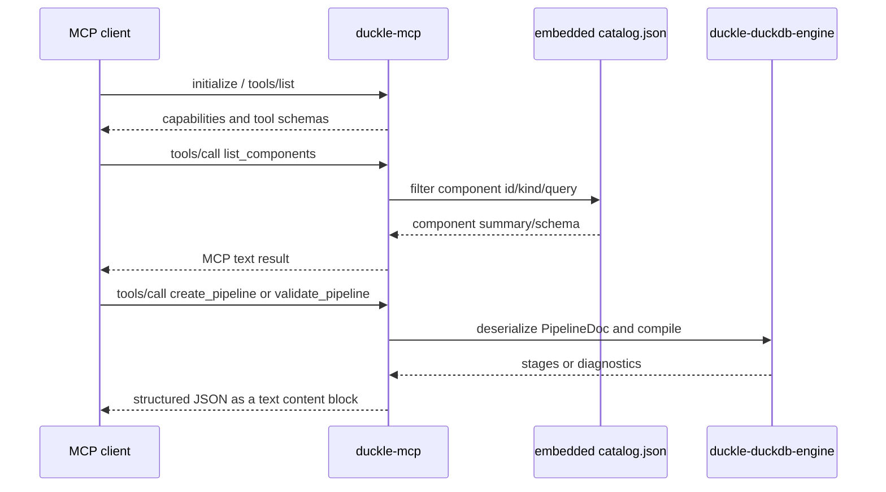

# Module: duckle-mcp

**Module path**: `crates/duckle-mcp`  
**Evidence**: static analysis of the crate, the frontend catalog exporter, and the engine contracts on 2026-07-16.

## Business Context

### Module Purpose

`duckle-mcp` is Duckle's headless Model Context Protocol server. It lets an MCP client discover the component catalog, create and edit pipeline JSON, validate/execute pipelines, inspect governance information, build runnable artifacts, and manage workspace connections without starting the React or Tauri application.

### Primary Use Cases

1. **Component discovery**: an agent calls `list_components` then `get_component_schema` before creating nodes.
2. **Pipeline authoring**: an agent creates, updates, reads, validates and runs a `PipelineDoc`.
3. **Review and governance**: an agent obtains lineage, impact, contracts, trust and schema-drift reports.
4. **Workspace operations**: an agent lists/creates connections and reads run logs.

### Domain Concepts

- **Component catalog**: generated snapshot of frontend palette/manifests; it contains ids, kinds, fields and ports.
- **PipelineDoc**: serializable pipeline graph consumed by the planner and executor.
- **Tool**: an MCP operation registered in `tools/list` and dispatched by name.
- **Resource/prompt**: read-only catalog/pipeline-format documents and a pipeline-generation prompt.
- **Connection**: workspace JSON; MCP accepts only environment placeholders for secret fields because it has no desktop encryption key.

## Technical Overview

### Module Type

Rust stdio JSON-RPC 2.0 server implementing MCP protocol revision `2024-11-05`.

### Dependencies

| Dependency | Role |
|---|---|
| `duckle-duckdb-engine` | Pipeline parsing, compilation, execution, lineage, drift and trust functions. |
| `serde` / `serde_json` | JSON-RPC framing and all tool DTOs. |
| Frontend exported `catalog.json` | Embedded schema catalog via `include_str!`. |

### Module Structure

```text
crates/duckle-mcp/
  Cargo.toml       binary/dependency configuration
  catalog.json     committed generated component catalog
  src/main.rs      stdio JSON-RPC server and MCP method router
  src/tools.rs     tool, resource and prompt declarations/handlers
  src/catalog.rs   embedded catalog loading, filtering and lookup
```

## Protocol and Workflow



### Transport and Error Model

- `main.rs` reads one JSON-RPC message per stdin line and writes one line to stdout.
- Requests without an `id` are notifications and do not receive a response.
- Parse/method/invalid-parameter failures are JSON-RPC errors.
- A recognized MCP tool returns `{ content: [{ type: "text", text: ... }], isError }`; domain errors use `isError: true` so the client can inspect them.
- The server is intentionally synchronous per stdin request; `run_pipeline` invokes the engine in-process.

## MCP Surface

### JSON-RPC Methods

| Method | Handler | Purpose |
|---|---|---|
| `initialize` | `main.rs::dispatch` | Advertises protocol, tools, resources and prompts. |
| `ping` | `main.rs::dispatch` | Liveness response. |
| `tools/list`, `tools/call` | `tools.rs` | MCP tool schema and execution. |
| `resources/list`, `resources/read` | `tools.rs` | `duckle://catalog` and `duckle://pipeline-format`. |
| `prompts/list`, `prompts/get` | `tools.rs` | `generate_pipeline` prompt. |

### Tool Groups

| Group | Tools |
|---|---|
| Catalog | `list_components`, `get_component_schema` |
| Pipeline lifecycle | `create_pipeline`, `update_pipeline`, `read_pipeline`, `list_pipelines`, `validate_pipeline`, `run_pipeline`, `build_pipeline` |
| Analysis | `pipeline_lineage`, `verify_pipeline`, `suggest_contracts`, `pipeline_impact`, `diff_pipelines`, `trust_report`, `schema_drift` |
| Workspace | `list_connections`, `create_connection`, `read_run_logs` |

## How a New Source or Sink Becomes Available in MCP

### Standard Component: No New MCP Tool

For a normal `src.*` or `snk.*`, MCP support is inherited automatically once the component exists across Duckle's normal product layers:

1. Add the palette/manifest definition, with stable `id`, `kind` (`source` or `sink`), property fields and port definitions, in the frontend component system.
2. Add planner behavior for that `componentId` in `duckle-duckdb-engine` and, when it is runtime-driven, the corresponding `RuntimeSpec` and executor dispatch.
3. Add graph/planner/execution tests appropriate to source/sink semantics.
4. Regenerate the committed MCP catalog with `npm --prefix frontend run export-catalog`.
5. Build/test `duckle-mcp`; `list_components` and `get_component_schema` will then expose the new component, and the generic pipeline tools will validate/run it through the engine.

The catalog generator is `frontend/scripts/export-catalog.ts`. It serializes `ALL_COMPONENTS`, `portsForComponent` and `synthesizeManifest`; `crates/duckle-mcp/src/catalog.rs` embeds the resulting `catalog.json`. The frontend manifest is therefore the catalog authority, while the engine remains the execution authority.

### Dedicated MCP API: Only for a New Operation

Add a bespoke MCP tool only when an agent needs an operation that cannot be expressed as pipeline creation, validation, run, analysis, connection management or a static resource. Examples include a connector-specific discovery/test operation or a remote asset browser.

For such an API:

1. Add a `tool(name, description, inputSchema)` entry in `tools.rs::list_tools`.
2. Add the tool name and handler to `tools.rs::call_tool`.
3. Implement the handler with typed/validated JSON, bounded output and secret-safe diagnostics.
4. Reuse engine/domain code rather than duplicating planner logic in MCP.
5. Add unit tests in `tools.rs`; use a service-gated integration test if it talks to a real system.
6. Add a resource or prompt only if discovery/documentation needs it; update `INSTRUCTIONS` when the normal MCP workflow changes.

## Security and Compatibility Rules

- Never expose plaintext secrets in the catalog, tool result, errors or logs. `create_connection` rejects literal secret values and accepts `${ENV:KEY}` placeholders only.
- Keep port handles stable. A display-label change such as `out` → `main` does not require a migration when the persisted port id remains `main`.
- Regenerate `catalog.json` whenever a manifest, fields, ports, component availability, label or summary changes; otherwise MCP will expose stale schemas even if the desktop UI is correct.
- The catalog is generated as part of this change and now contains `src.query` with its sole `main` output port and the explicit Query Source field schema.
- Do not make the manifest the planner authority: `validate_pipeline` and `run_pipeline` rely on the Rust planner/executor and must reject unsupported configurations authoritatively.

## File Organization

| File | Responsibility |
|---|---|
| `src/main.rs` | MCP protocol version, stdio framing, JSON-RPC dispatch and responses. |
| `src/tools.rs` | Public tool schemas, dispatch, workspace file helpers, security masking and test coverage. |
| `src/catalog.rs` | Lazy catalog parsing, list filtering and component schema lookup. |
| `catalog.json` | Generated frontend component snapshot embedded at compile time. |
| `Cargo.toml` | Binary definition and engine/target-specific dependencies. |

## Quality Observations

### Strengths

- One generic MCP pipeline surface covers all components, avoiding a source/sink-specific tool explosion.
- The generated catalog prevents schema duplication between MCP and the frontend.
- Planner compilation is reused for authoritative validation.
- Connection creation has an explicit no-plaintext-secret rule.

### Risks and Recommendations

- `catalog.json` is a committed generated artifact, so it can drift after a frontend manifest edit. Make `export-catalog` part of the component-change checklist and CI validation.
- Tool definitions and dispatch are parallel manual lists. A registration macro/table could prevent a declared tool from lacking a handler.
- MCP runs in a long-lived process and mutates process environment for DuckDB/workspace selection per run. Keep concurrent-request behavior explicit if server parallelism is introduced.

## Testing

`tools.rs` contains unit tests for structural risk, trust report, schema drift, pipeline diff/impact and connection-secret behavior. Run at least:

```powershell
npm --prefix frontend run export-catalog
cargo test -p duckle-mcp
```

Use the workspace test command for any engine/planner changes, with `DUCKLE_DUCKDB_BIN` set when execution tests require the DuckDB CLI.
