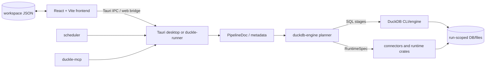

# Duckle

## Introduction

Duckle è uno studio ETL/ELT local-first: l’utente costruisce pipeline grafiche, le salva come file di workspace e le esegue localmente tramite DuckDB. Il repository contiene un’app desktop Tauri, un frontend React/TypeScript, un runner web/CLI e un workspace Rust multi-crate. Il README descrive anche un assistente AI locale e un catalogo esteso di connector; questa panoramica tratta il codice e le configurazioni presenti nel repository.

## Project Architecture

### Technology Stack

- **Languages**: Rust 2021 (toolchain minima dichiarata 1.80), TypeScript/React.
- **Desktop framework**: Tauri 2 (`apps/desktop`).
- **Frontend**: React 19, TypeScript 5.7, Vite 6, `@xyflow/react` per il canvas.
- **Execution engine**: DuckDB CLI/engine, con planner Rust e `RuntimeSpec` per i connector non SQL.
- **Persistence**: workspace file-based (JSON e directory per item), database/file intermedi intermedi di run.
- **Packaging/CI**: Cargo, npm, GitHub Actions e GitLab CI; packaging Tauri per Windows, macOS e Linux.
- **License**: MIT OR Apache-2.0.

### Workspace and module structure

Il workspace Cargo è dichiarato in `Cargo.toml` e comprende:

- `apps/desktop`: entry point Tauri, comandi IPC, gestione segreti e configurazione desktop.
- `crates/duckdb-engine`: compilazione del grafo, planner, materializzazione ed esecuzione DuckDB.
- `crates/metadata`: tipi serializzati di pipeline/nodi/archi.
- `crates/connectors`: implementazioni e contratti dei connector.
- `crates/runtime`, `execution-core`, `workflow-engine`, `transform-engine`, `stream-engine`: runtime e componenti di esecuzione specializzati.
- `crates/scheduler`: scheduling e trigger.
- `crates/duckle-runner`: modalità web/runner e bridge HTTP.
- `crates/duckle-mcp`: integrazione MCP.
- `crates/plugin-sdk`: SDK per estensioni.
- `crates/slothdb-engine` e `crates/duckle-lance`: engine/storage alternativi o specializzati.
- `frontend`: applicazione React/Vite, manifest dei componenti, editor di pipeline e workspace.

### Architecture diagram



### Key components and data flow

1. Il frontend costruisce un `PipelineDoc` composto da nodi e archi e persiste il workspace come file.
2. Il bridge invoca comandi Tauri o endpoint del runner passando pipeline e parametri di run.
3. Il planner Rust valida il grafo, ordina gli stage e sceglie SQL DuckDB, materializzazione o `RuntimeSpec`.
4. L’executor crea database/file intermedi per la run, avvia il DuckDB CLI quando necessario e coordina connector/runtime stages.
5. Eventi di esecuzione e preview ritornano al frontend per stato, schema, SQL e diagnostica.

Il percorso SQL batch può usare un singolo processo per una pipeline interamente compatibile; il percorso per-stage usa processi DuckDB separati. Non esiste nel codice attuale un worker persistente generico per sessioni condivise tra gruppi di stage.

## Getting Started

### Prerequisites

- Rust toolchain conforme a `rust-toolchain.toml` e Cargo.
- Node.js/npm compatibili con il frontend.
- Dipendenze di sistema Tauri/WebView per il sistema operativo.
- DuckDB CLI: il README indica `DUCKLE_DUCKDB_BIN` per i test e un installer al primo avvio dell’app.
- Docker solo per i test/integration service che richiedono PostgreSQL, MySQL o MinIO.

### Configuration

Configurazioni rilevanti documentate nel repository:

- `DUCKLE_DUCKDB_BIN`: percorso del binario DuckDB usato dai test/run.
- `DUCKLE_CA_CERT`: CA PEM aggiuntiva per ambienti con proxy TLS.
- `HTTPS_PROXY`, `HTTP_PROXY` o `DUCKLE_HTTPS_PROXY`: proxy per connector HTTP/cloud.
- `apps/desktop/tauri.conf.json`: configurazione Tauri, bundle e frontend.
- `frontend/vite.config.ts`: dev server e build frontend.

I secret delle Connection sono gestiti dal modulo desktop `apps/desktop/src/secrets.rs`; non devono essere inseriti nei file pipeline o nei log.

### Local development setup

```text
npm --prefix frontend install
npm --prefix frontend run dev
cargo build --workspace
```

Per verifiche tipiche:

```text
cargo fmt --all --check
cargo test --workspace --exclude duckle-lance
cargo clippy --workspace --all-targets --exclude duckle-lance
npm --prefix frontend run lint
npm --prefix frontend run build
```

### Running the application

- Frontend standalone: `npm --prefix frontend run dev`.
- Desktop development/build: seguire gli script `dev.cmd`, `dev.ps1`, `build.cmd` e la configurazione in `apps/desktop`.
- Runner web: usare i target e i container descritti in `Dockerfile.web`, `docker-compose.web.yml` e `crates/duckle-runner`.

Il comando esatto per il packaging dipende dal profilo Tauri e dal sistema operativo; il workflow di release usa build Rust con `--features custom-protocol`.

### Deployment and distribution

`.github/workflows/ci.yml`, `.github/workflows/release.yml` e `.gitlab-ci.yml` coprono build/test su Linux, macOS e Windows, build desktop e rilascio su tag `v*`. Il README documenta asset di release, firma/distribuzione e upload GitLab; le credenziali di firma non sono presenti nel repository e sono quindi configurazione CI esterna.

## Additional Resources

- [README del progetto](../../../README.md)
- [Documentazione architetturale](../../../docs/architecture/README.md)
- [Contributing](../../../CONTRIBUTING.md)
- [Roadmap](../../../docs/roadmap.md)
- [Cargo workspace](../../../Cargo.toml)
- [Frontend package](../../../frontend/package.json)
- [Tauri configuration](../../../apps/desktop/tauri.conf.json)

## Evidence and limitations

Questa panoramica è ricostruita da file presenti nel repository. Numeri di connector, benchmark, servizi CI esterni, certificati di firma e dipendenze runtime scaricate al primo avvio sono dichiarazioni/configurazioni esterne al codice e non vengono trattati come evidenza di un ambiente locale funzionante.
