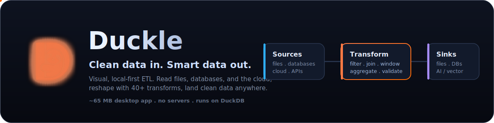

# Sponsor Duckle

Duckle is a free, open-source, local-first ETL / ELT studio: drag a pipeline
onto the canvas, run it at native speed through DuckDB, and own your data end to
end. No cloud, no servers, no lock-in.

It is built in the open, clean-room, and given away for free. Sponsorship is what
lets that continue: it pays for the time to ship connectors, keep the engine
fast and correct, write the docs, and turn issues around quickly.

If Duckle saves you or your team time (or a warehouse bill), please consider
sponsoring its development.

### [Become a sponsor on GitHub Sponsors](https://github.com/sponsors/SouravRoy-ETL)

---

## What your sponsorship funds

- **More connectors** - moving roadmap sources/sinks into the verified, runnable set.
- **Engine speed + correctness** - faster runs, lower memory, fewer surprises on real data.
- **The desktop app** - the visual designer, the on-device AI assistant, the in-app integrations.
- **Docs + examples** - guides, recipes, and reproducible demos.
- **Faster issue turnaround** - bugs reported by sponsors get looked at first.

## Tiers

Tiers are configured on the [GitHub Sponsors page](https://github.com/sponsors/SouravRoy-ETL);
this is the gist:

| Tier | Monthly | What you get |
|---|---|---|
| **Supporter** | $5 | Our thanks, the sponsor badge on your profile, and your name in this file. |
| **Backer** | $25 | The above, plus priority triage on your GitHub issues. |
| **Sponsor** | $100 | The above, plus your name / logo in the README and a say in the roadmap. |
| **Organization** | $500 | The above, plus a direct support channel and prioritized connector requests. |

One-time sponsorships are welcome too - use the **one-time** option on the
GitHub Sponsors page.

## Other ways to help (free)

Not everyone can sponsor, and that is completely fine. These help just as much:

- Star the repo: [ducklelabs/duckle](https://github.com/ducklelabs/duckle)
- File clear bug reports and feature requests.
- Share Duckle with a colleague, or write about how you use it.
- Contribute a fix or a connector (see the contributing notes in the README).

## Sponsors

Sponsors will be listed here. Thank you for keeping Duckle free and open.

<!-- sponsors -->
<!-- Add sponsor names / logos here. -->
<!-- /sponsors -->
