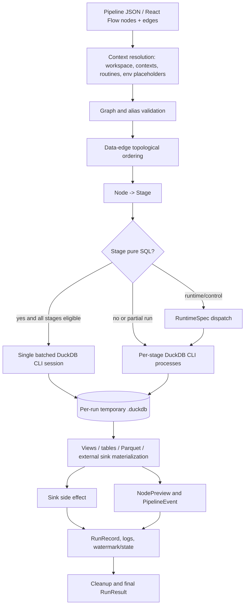
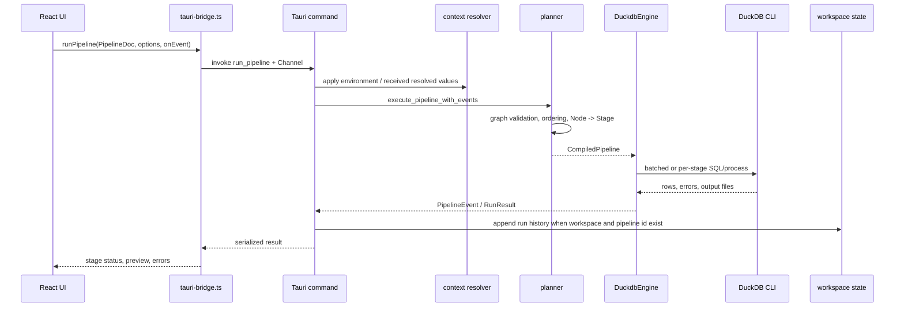
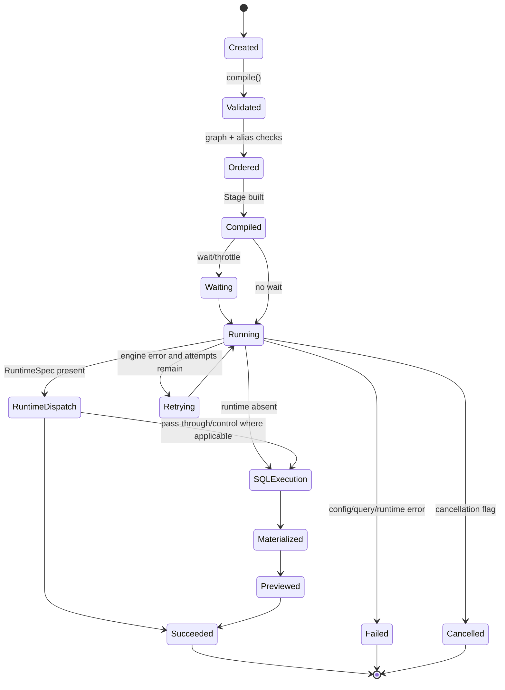
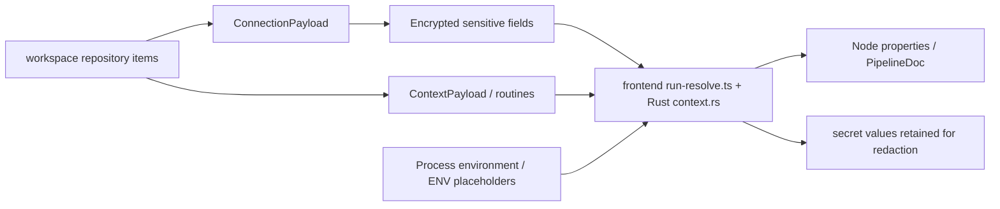

# Execution model

> Il flusso seguente descrive il comportamento osservato, incluse le
> differenze tra run desktop, run parziale e runner headless.

## Flusso principale

## Desktop sequence

`run_pipeline_partial` performs a backward traversal along data edges and
compiles only the upstream subgraph. Partial runs do not use the batched path;
the target becomes a leaf for preview.

## Planner and stage lifecycle

`Stage::is_pure_sql()` is true only when `runtime` is absent and the component
does not need a Rust post-write hook such as the current Excel path. The
executor batches only when the full pipeline is eligible: no target partial
run, no retries/waits/memory overrides, and no runtime/sink guard that forces
per-stage execution.

## Materialization

The engine opens a temporary on-disk DuckDB database for a run. Intermediate
relations may be represented as temporary tables, views or temporary Parquet
depending on consumer count, source/attach behavior, rejection/reuse paths,
and whether the run is batched or partial. A source configured for a live view
can be upgraded only in the compatible single-session path; partial runs keep
materialized tables across separate CLI processes.

Sinks produce external effects through `COPY`, connector drivers, HTTP, files,
or other runtime implementations. Existing-target checks, retries, cleanup,
row counts and preview are part of observable behavior.

## Connection, context and secret resolution

The frontend resolves workspace/context/date-style values before a canvas run;
the desktop command applies environment variables. The headless runner and
scheduler use the Rust context resolver. Secret values are carried to the
engine for connector use and are tracked for masking; the encryption service
stores sensitive connection fields at rest.

## Error, cancellation and history

`EngineError` categorizes configuration, unsupported, query and cancellation
failures. Tauri command errors are generally serialized as `String`. The
current run owns an atomic cancellation flag; `cancel_pipeline` requests
termination of the active DuckDB child process. Stage events are streamed via
`Channel<PipelineEvent>`, while history is appended as `RunRecord` under the
workspace when identifiers are provided.

## Confirmed gaps

- Materialization policy is encoded across planner and executor rather than a
  standalone materialization type.
- The Tauri adapter still contains orchestration in `lib.rs`.
- Frontend/E2E execution coverage is not detected; Rust engine tests dominate.

## Query Source preview and Data Source affinity

La preview di `src.query` costruisce un singolo processo DuckDB con gli
`ATTACH` temporanei dei Data Source risolti dal workspace, esegue un solo
statement read-only e restituisce schema, massimo 1000 righe, durata e
`contextId`. Il limite è 30 secondi; timeout ed errori restituiscono codici
sanitizzati senza dettagli di connessione.

Una pipeline interamente SQL che contiene `src.query` usa il worker CLI
persistente descritto in `docs/architecture/adr-affinity-session.md`: ciascun
alias Data Source viene collegato una sola volta nel worker, ogni Query Source
materializza una `TABLE` nel run database e Join/Sink downstream leggono tale
relazione senza dipendere dal catalogo esterno. Count, schema e preview sono
letti nello stesso processo, perché il worker possiede il lock del run-db.
Pipeline con runtime/control o altri confini non compatibili mantengono il
percorso per-stage esistente finché lo scheduler di compatibilità per gruppi
non viene completato.
