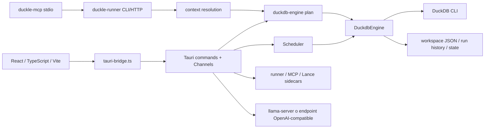

# System overview

> Stato: architettura implementata rilevata dal repository. Le sezioni
> “Gap” e “Raccomandazione” non descrivono codice esistente.

## Componenti effettivi

| Componente | Percorso | Responsabilità osservata |
|---|---|---|
| Frontend | `frontend/` | React/TypeScript/Vite, canvas React Flow, editing, persistenza workspace, preview e bridge IPC. |
| Desktop shell | `apps/desktop/` | Tauri 2, registry dei comandi, capability, servizi desktop e sidecar embedded. |
| Metadata | `crates/metadata/` | Tipi serializzabili di pipeline, nodi, archi e schema. |
| Planner | `crates/duckdb-engine/src/plan/` | `PipelineDoc` → `Stage`/`RuntimeSpec`/`CompiledPipeline`; validazione e ordinamento. |
| Execution engine | `crates/duckdb-engine/` | DuckDB CLI, esecuzione batch o per-stage, connector runtime, preview, cancellation e history. |
| Runner | `crates/duckle-runner/` | CLI headless, build di bundle e server HTTP/web. |
| Scheduler | `crates/scheduler/` | Cron, interval e file-watch; persistenza in `schedules.json`. |
| MCP server | `crates/duckle-mcp/` | Server stdio JSON-RPC e catalogo/tool MCP. |
| Altri crate | `connectors`, `runtime`, `workflow-engine`, `transform-engine`, `stream-engine`, `duckle-lance`, `slothdb-engine`, `execution-core`, `plugin-sdk` | Supporto connector, runtime, engine e SDK; non esiste un registry unico di componenti. |

## Confini runtime

Il frontend invia al desktop un documento con nodi e archi. Il desktop
registra i comandi in `apps/desktop/src/lib.rs`; i comandi di run applicano le
variabili d’ambiente e delegano al motore. Il web runner usa uno shim HTTP/SSE
al posto di Tauri, senza cambiare il modello `PipelineEvent`/`RunResult`.

## Workspace e persistenza

- Pipeline e repository item sono gestiti da `frontend/src/workspace.ts`.
- Le connessioni sono item separati; i campi sensibili sono cifrati dal
  servizio in `apps/desktop/src/secrets.rs`.
- La history è in `runs/<pipeline_id>.json`; gli incremental watermark sono in
  `state/`; gli scheduler in `schedules.json`.
- Il motore usa un database DuckDB temporaneo per run; i processi CLI sono
  cancellabili terminando il processo attivo.
- Non è stato rilevato un framework di migrazioni SQL o una directory di
  migrazioni: compatibilità di workspace e pipeline JSON è gestita dal codice
  e da decisioni esplicite di compatibilità.

## Capabilities e distribuzione

Le capability sono in `apps/desktop/capabilities/default.json`: includono
filesystem con scope `**`, dialog, clipboard e opener. La CSP in
`apps/desktop/tauri.conf.json` è `null`. Il desktop incorpora runner e MCP
quando i sidecar sono staged; il workflow release produce binari raw e
checksum, non installer firmati secondo la CI rilevata.

## Gap confermati

- Le definizioni di componenti sono distribuite tra palette, manifest, catalogo
  MCP, planner ed executor.
- DTO Rust/TypeScript per IPC sono mantenuti manualmente.
- Alcuni edge di trigger esposti dal frontend non sono data-edge del planner
  Rust.
- Non è presente una suite frontend o end-to-end rilevata.
- `Engine`, `Connection`, `Context`, `Secret` e `StageResult` non sono tutti
  tipi centrali condivisi: alcuni sono confini concettuali composti da più
  strutture concrete.

## Shared Data Sources

Un item `data_source` persiste solo `kind`, `sqlAlias` e `connectionRef` in
`data-sources/<id>.json`. `src.query` conserva gli id dei Data Source e SQL
read-only; il desktop o il runner risolvono gli id in memoria prima del run o
della preview. Le credenziali non attraversano il frontend e non vengono
persistite nel `PipelineDoc` salvato.
